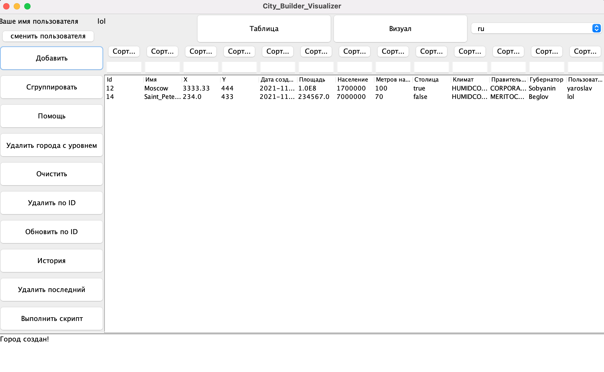
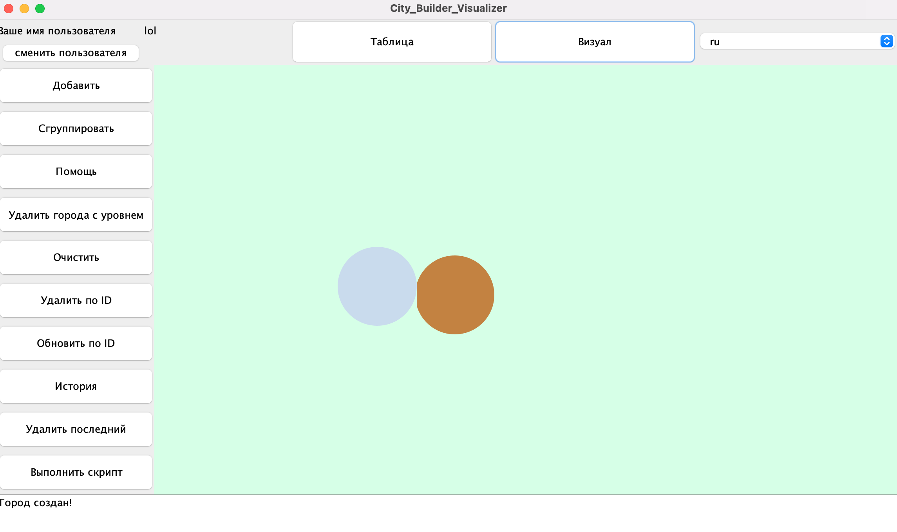

# City Builder Visualization
An application with GUI which allows you work with data of different Cities

**Functionality:**
- Registration and Authentication.
- Managing with table of existing cities.
- Filtration and Sorting
- Supporting different command of manipulation with cities.
  * _help_: display help for available commands.
  * _add_: add a new City.
  * _update_ **id**: refresh the value of the City item whose id is equal to the given one.
  * _remove_by_id_ **id**: remove a City item by its id.
  * _clear_: delete all items.
  * _execute_script_ **file_name**: execute the script from the specified file. The script contains commands in the same form as they are entered by the user in interactive mode.
  * _remove_last_ : delete last creating City item.
  * _sort_: sort the table.
  * _history_: print last 8 commands.
  * _remove_all_by_meters_above_sea_level_ **metersAboutSeaLevel**: delete all elements, which have the value of attribute metersAboveSeaLevel equals specified value.
  * _group_counting_by_population_: group all elements by attribute population, print count of elements from each group.
- Visualization of Cities, each user has their own color of created cities.
- Clicking on visualized items show information about it.
- Adding, deleting and updating cities.
- The GUI of the client part supports Russian, Finnish, Bulgarian and Spanish (Mexico) languages / locales.
  
**Technologies:**
1. Swing
2. Graphics 
3. Client-Server interaction by Sockets
4. Multithreading and Synchronization
5. Pattern Command
6. Translation by using Resource Bundle
7. Maven

**Launch**

1. `mvn package -PServer`
2. Write port in console
3. `mvn package -PClient`
4. Write the same port
